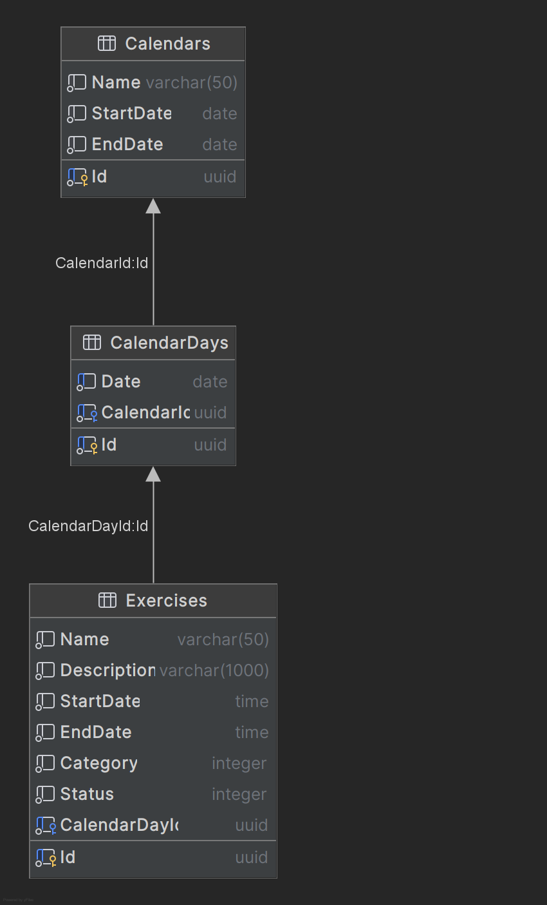

# Sport Calendar Web App

# Stack:

-------

## Backend

### - .NET 8 (ASP.NET)

### - _Fluent_: FluentAssertions, FluentValidation

### - _ORM_: EF Core

### - _DB_: Postgres (with Redis for caching)

### - _Tests_: xUnit, Moq, FluentAssertions

## Database Scheme

(`you can use int's instead of guid's (uuid's) cause of memory overhead and requirements`)

