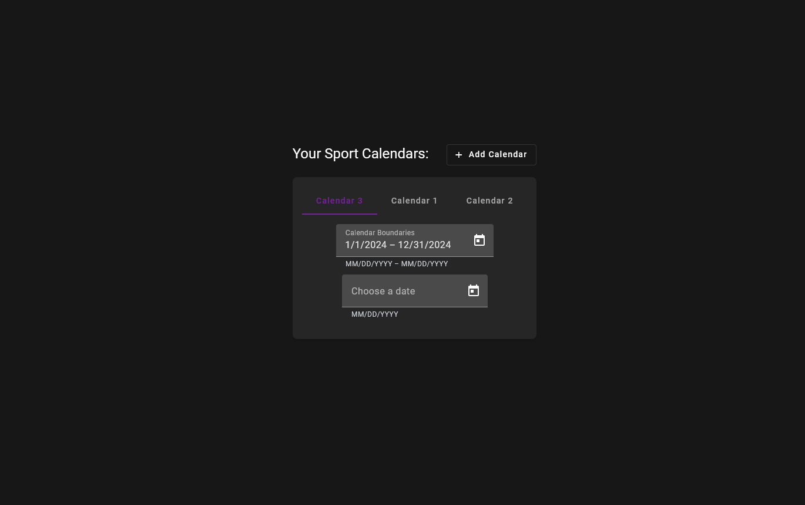
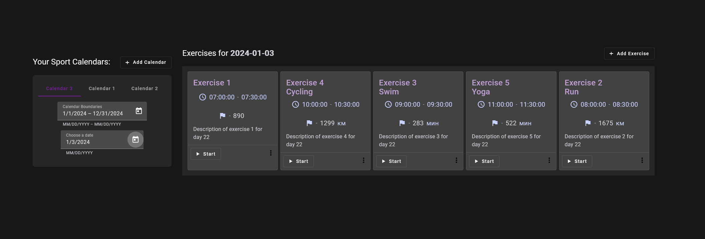
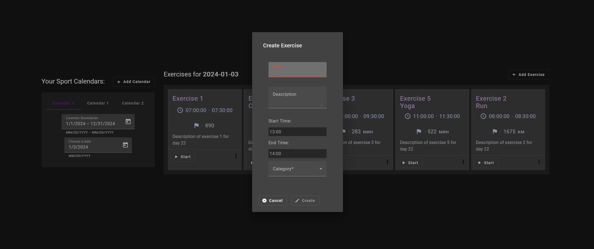

# Sport Calendar Web App

# Stack:

-------

## Backend

### - .NET 8 (ASP.NET)

### - _Fluent_: FluentAssertions, FluentValidation

### - _ORM_: EF Core

### - _DB_: Postgres (with Redis for caching)

### - _Tests_: xUnit, Moq, FluentAssertions

## Database Scheme

(`you can use int's instead of guid's (uuid's) cause of memory overhead and requirements`)

---------

# Frontend

### - _Angular 18_

### - _Material UI_ for Angular

### - Thanks for the help all the possibilities of httpClient and other ang-features i've had not used for full

## Web-App Screenshots

## How to continue development:

`restart and do better, cause ...`
 
1) Clone repo
2) If you are not lazy as i am, so you have to create dotnet secrets and change existing in api secret Id with connection string to db inside.
3) Start docker with connection string you could see before
4) Start api project and angular project.